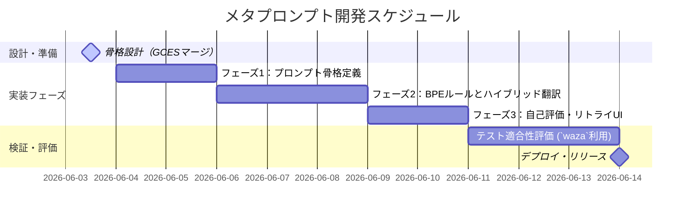

# 実装計画書 (plan.md)

本ドキュメントは、仕様書（spec.md）に定義された「メタプロンプト最適化エンジン（プロンプトを改善するプロンプト）」を具体的に開発・テスト・デプロイするためのフェーズ別実装計画である。
本計画は、仕様駆動開発（SDD）の実践キットである github/spec-kit のテスト駆動・仕様適合のライフサイクルモデルに依拠し、またトークンカウンティングや評価スコアの厳格な算出ロジックについて microsoft/waza の知見、およびプロンプトの頑健性を担保する技術について anthropics/skills のパターンを導入している。

## 1. 開発マイルストーン (Milestones)

## 2. フェーズ別詳細計画 (Phase Details)

### フェーズ 1: メタプロンプトの骨格定義 (Skeleton and Parsing Engine)
- **目標：** ユーザー入力を正確にパースし、GCES（Goal, Context, Expectations, Source）構造を適用する「メタプロンプトの基礎」を定義する。
- **タスク：**
  - メタプロンプト自体の役割（ゴール設定）を明確化。
  - ユーザーが入力した「改善対象プロンプト」を境界識別子（Markdownブロックなど）で隔離し、不要な解説文（ノイズトークン）と分離するパース構造 of 作成。
- **成果物：** プロンプト骨格のドラフト。

### フェーズ 2: BPE最適化および英日ハイブリッド翻訳モジュールの実装
- **目標：** GPT-5クラスの o200k_base トークナイザーおよび主要LLMトークナイザーに対する圧縮効率を最大化する。
- **タスク：**
  - 指示ロジックの「英語化」ルール、および背景・コンテキストの「構造化（Markdown List / YAML）」ルールの組み込み。
  - 冗長な日本語助詞や手続き的表現を体言止め、または宣言的構文（RFC 2119基準）に変換する命令セットをプロンプトにインジェクション。
  - **アプローチ検証：** anthropics/skills のアプローチを参考に、プロンプトを再利用可能な「構造化スキル」として定義。

### フェーズ 3: 自己評価およびユーザー主導リトライインターフェースの実装
- **目標：** 確定した質問3の「可視化ハイブリッドループ（C）」を実現する。
- **タスク：**
  - AIが自己評価スコア（セマンティクスの損失、BPE圧縮率、曖昧度）を出力するテンプレートの固定。
  - ユーザーが容易にループを回せるよう、コピー＆ペースト可能な /retry コマンド形式を提案する出力構造 of 設計。
- **成果物：** 対話型自己検証ループを備えたメタプロンプトの完成。

### フェーズ 4: 評価・テスト (microsoft/waza を用いた適合性評価)
- **目標：** 開発したメタプロンプトが「意味を損なわずにトークンを実質削減しているか」を測定する。
- **タスク：**
  - テストプロンプトセット（3つの代表的なユースケース）を用意する。
  - microsoft/waza で推奨されるトークンカウンティング、およびセマンティクス（要件の包含数）が最適化前後で100%一致しているかを手動・自動のダブルチェックで測定。
  - 目標閾値（BPE消費：25%以上削減、曖昧表現：0件）を達成できるまで、メタプロンプトの指示をマイクロチューニング。

## 3. テスト計画・ガードレール (Testing & Guardrails)

メタプロンプトの品質（頑健性）を維持するため、以下のガードレール（制約テスト）を開発プロセスに組み込む。

| テスト項目 | 期待される結果 (Acceptance Criteria) | 評価指標 | 参照アセット |
| :--- | :--- | :--- | :--- |
| セマンティクス損失試験 | 改善前プロンプトの要求要件（チェックリスト）が、改善後にも100%網羅されていること。 | 要件網羅率: $100\%$ | github/spec-kit |
| トークン削減効率測定 | ターゲット（GPT-5 / Claude 3）における実消費トークン数が減少していること。 | 削減率: $25\sim40\%$ | microsoft/waza |
| 挨拶・プレフィックス排除 | 出力結果に余計な会話や解説（"Sure, I can do that!" など）が絶対に混入しないこと。 | ノイズ混入率: $0\%$ | anthropics/skills |

## 4. リスクと対策 (Risks & Mitigation)

- **トークナイザーの互換性リスク：**
  - **リスク：** 各モデル（GPT-5, Claude）で圧縮結果に揺らぎが生じる。
  - **対策：** プロンプト設計において特定の語彙に依存しすぎず、普遍的に効率性の高い「英語指示＋YAML表現」のウエイトを高める。
- **圧縮しすぎによる意味消失リスク：**
  - **リスク：** BPE効率を追うあまり、本来のプロンプトが持っていた文脈やニュアンスが失われる。
  - **対策：** フェーズ3の「自己評価チェックリスト」において、SemanticsRetained (意味の保持度) の検証ステップに最も高い優先順位（最重要ガードレール）を割り当てる。
  